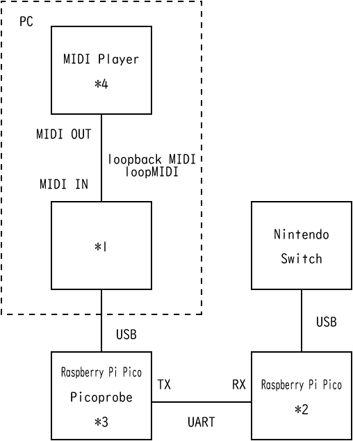

# nst

Raspberry Pi PicoをNintendo Switchにコントローラーとして認識させ、PCから制御するソフトウェアになります。
Raspberry Pi Pico 2枚とPCを組み合わせて使用します。

Raspberry Pi Pico側のFirmwareはこちらで公開しています。
[https://github.com/hiyuna36/proctrl001_022210](https://github.com/hiyuna36/proctrl001_022210)

## 動作環境

* Windows 10
* Windows 11

## xinput2npc

PC側に接続されたXInput対応のゲームパッドでSwitchを操作するプログラムです。
* Homeボタンはキーボードの右Ctrlキーを割り当てています。

### 接続例

|ソフトウェアの種類|実行先|ソフトウェア名|備考|
|--|--|--|--|
|*1 xinput2npc|PC|（本ソフトウェア）||
|*3 Picoprobe|Raspberry Pi Pico(左)||USB-UART変換として使用する|
|*2 PROCTRL001|Raspberry Pi Pico(右)|https://github.com/hiyuna36/proctrl001_022210||

## midiin2npcsky

MIDI INからの信号を元にSwitch版「Sky 星を紡ぐ子どもたち」の楽器を演奏するプログラムです
本ソフトウェアはTGCの公式のものではありません。

* C4～C6の白鍵を割り当てています。
* 和音は時間差で押すようにしているため和音数が多い曲、テンポが速い曲は向きません。

### 接続・組み合わせ例

MIDIファイルを演奏させる場合

|ソフトウェアの種類|実行先|ソフトウェア名|備考|
|--|--|--|--|
|*4 MIDI Player|PC|TMIDI Player|MIDI OUTの指定が可能なMIDI Player|
|loopback MIDI|PC|loopMIDI|MIDI INとMIDI OUTをPC内部で仮想的に接続する|
|*1 midiin2npcsky|PC|（本ソフトウェア）||
|*3 Picoprobe|Raspberry Pi Pico(左)||USB-UART変換として使用する|
|*2 PROCTRL001|Raspberry Pi Pico(右)|https://github.com/hiyuna36/proctrl001_022210||

## settings

上記プログラムで使用する通信ポートの設定を行うプログラムです。

* Serial Port -- Raspberry Pi Pico側と通信するポートを指定します。
* Midi In Port -- midiin2npcskyで使用するMidi Iｎのポートを指定します。

